# Spring框架概述

Spring框架如图所示包含三个部分：
1. **Core容器**：包含四个对象。
2. **DataAccess/Integration层**：用于访问数据库。
3. **Web层**：用于Web开发。

这就是Spring Framework的系统架构。

## 学习路线

### DAO对象与Spring中的Bean对象

之前使用DAO对象进行数据操作，在Spring框架中将DAO对象封装到了Bean对象当中，因此在Spring Framework中的数据操作变成了对Bean对象的操作。

在之前的DAO对象中，我们使用JDBC进行数据库操作，这种方式耦合度偏高。将其从代码中拆解出来，独立管理提供，降低耦合度，这种思想叫做IOC思想（控制反转），即将对象的创建控制权转移到外部。

在Spring中，使用IoC容器实现了这一思想，用这个IoC容器充当了IOC思想的外部。

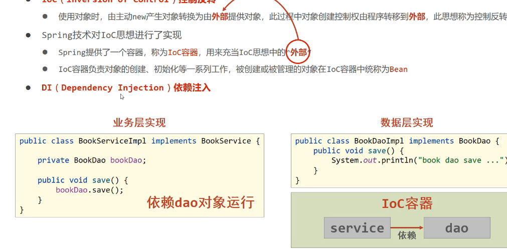

在IoC容器中，我们注册了DAO对象和Service对象。Service对象依赖DAO对象，当需要Service对象时，IoC容器会自动创建Service对象，并将DAO对象注入到Service对象中，这样就实现了依赖注入。

这个关系称为注入。简单来说，就是把原来的单个类注册到一个容器中，一般是xml。然后在之后的应用调用这个容器的类时，就可以直接从容器调用，而非直接去调用类。这些类可以分为service，DAO，POJO之类。

## IoC入门案例

IoC容器是管理Service和DAO的对象，通过xml告知IoC容器管理的对象，并通过IoC容器的接口获得容器，再通过容器获得想要的bean（IoC容器所包含的）。使用Spring导入坐标：

1. 导入Spring-context
2. 导入bean对象

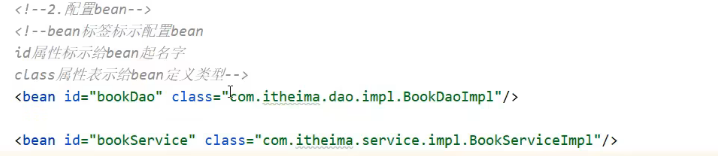

3. 获取bean对象

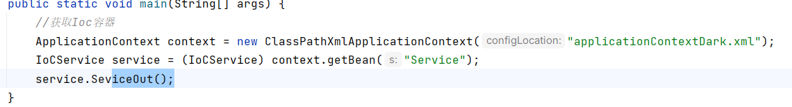

    1. 先获取IoC容器，即ApplicationContext。
    2. 然后通过容器的getBean方法，获得bean对象，将bean对象转化为对应的类，调用类的方法。

### DI（依赖注入）入门案例

向容器告知类的注入关系，在被注入的类中提供一个方法作为注入的门。

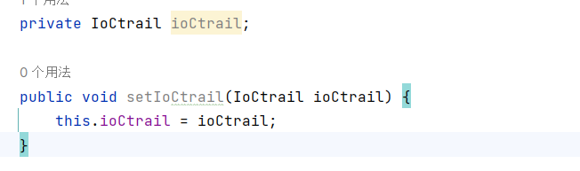

然后在xml中配置注入关系。

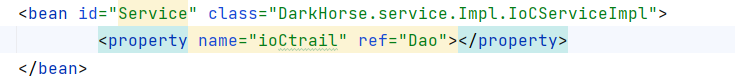

`name`表示要注入的对象，`ref`是bean对象的ID，`property`表示注入的bean的属性。如此之后再在被注入的类中使用对象时就实现解耦了。

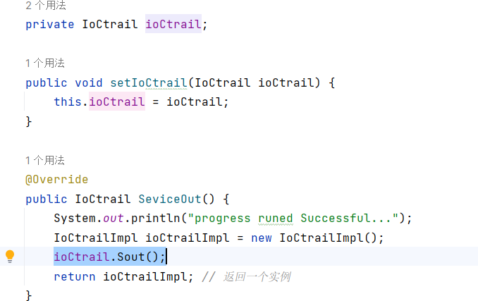

## Bean的配置

### Bean的基础配置、别名配置和作用范围配置

使用`name`属性可以为Bean定义别名，多个别名之间使用空格分隔。

### Bean的作用范围

Bean在Spring中分为单例和非单例，单例就是单个bean对象，Spring默认创建单例。Bean对象的单例和多例通过xml配置，`singleton`为单例，`prototype`为多例。

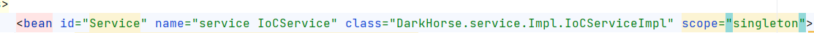

单例指的是在调用bean对象时是否会重复创建，若是多例则会重复创建bean对象，若只需要反复使用一个bean对象，则使用单例。

以下bean适合使用单例：
1. servlet
2. service
3. DAO
4. tool

封装实体的域对象，则不适合交给bean对象管理，因为有状态，记录了信息。

### Bean的实例化

1. 使用无参构造方法实例化。在xml中创建bean对象后提供一个bean对象的实体类，在实体类中添加无参构造方法用以实例化bean对象。

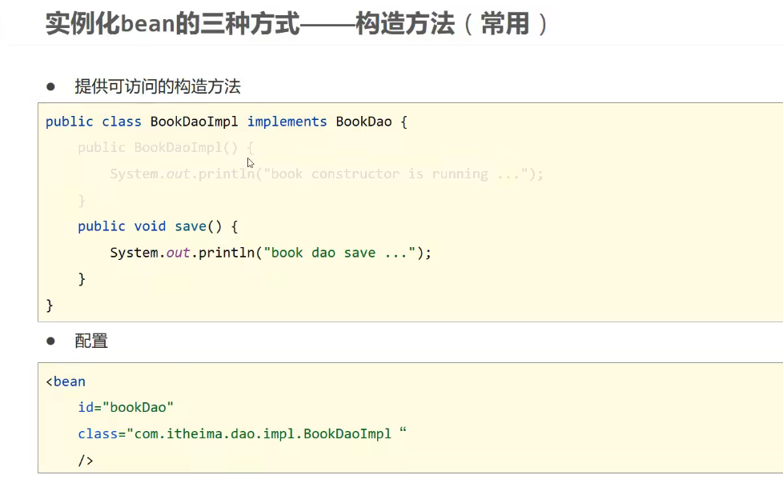

2. 使用静态工厂实例化。

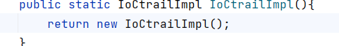

    第一步，编辑一个工厂类，该工厂类用于生产实体类，然后在xml中注册工厂类的方法，之后Spring就会将工厂类生产的实体类注册为bean对象，然后使用工厂类所注册的ID。

3. 使用实例工厂实例化bean。

    这种方式是先将工厂对象创建为bean对象，然后调用bean对象创建DAO的bean对象，最后再调用DAO的bean对象。

4. 标准的工厂实例化bean。

   这种方式是使用Spring规范的工厂类，该工厂类固定了获得类的方法。在其中填写好泛型和返回对象，以及返回对象的类型即可。

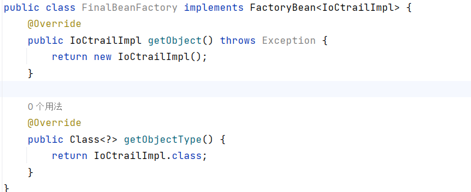

    最后配置好bean对象即可。

在工厂类中使用这个方法控制bean是否为单例。

## Bean的生命周期

1. Bean在创造之前的初始化。
2. Bean在创造之后的使用。
3. Bean销毁之后的回收。

Bean的初始化和销毁编写在bean对象对应的类中，在xml中添加对应的init和destroy方法即可。

由于程序运行在Java虚拟机中，所以程序关闭前没有机会执行bean的销毁方法，因此销毁方法在程序关闭后不会执行。执行销毁方法有两种办法：

1. 调用容器的下一层接口，该接口具有容器的close方法，调用close方法关闭容器即可执行bean的销毁操作。

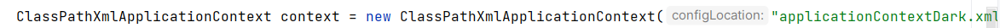

2. 设置关闭钩子。

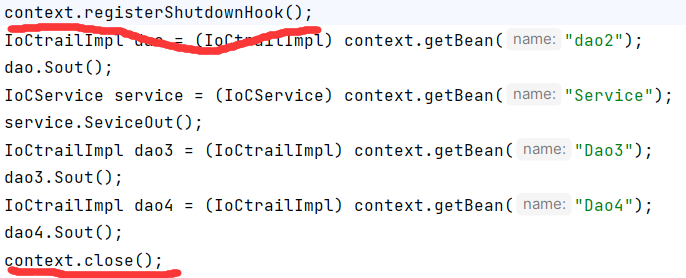

钩子执行在代码运行完毕之后，close执行在代码运行完毕之前。

在方法名中继承自InitializingBean接口和DisposableBean接口，重写afterPropertiesSet和destroy方法即可。这种方式即可不编写XML了。

## 依赖注入

1. 构造方法注入
2. set方法注入

引用数据类型或者引用的bean携带数据类型时传递的数据分两种，一种为引用数据类型，一种是简单数据类型。

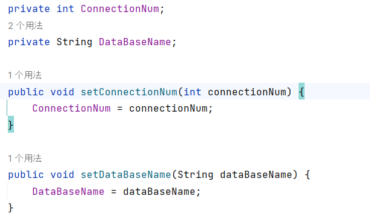

### Setter注入

在想要注入的位置构建好参数，可以是一个类也可以是简单类型。然后提供Setter方法，在xml中使用property注入，ref提供引用类，value提供简单值。

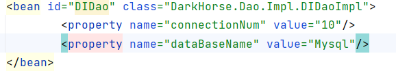

### 构造方法注入

在类中使用构造方法，在xml中也稍有不同。

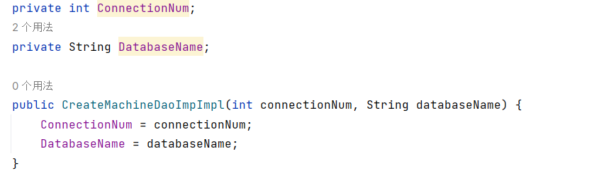

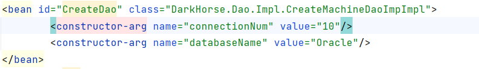

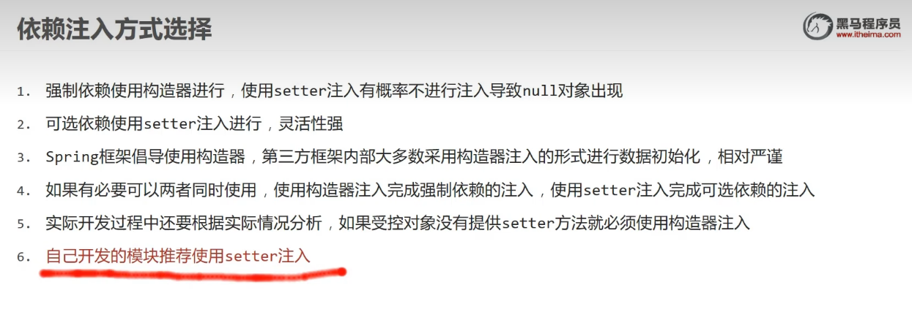

## 自动装配

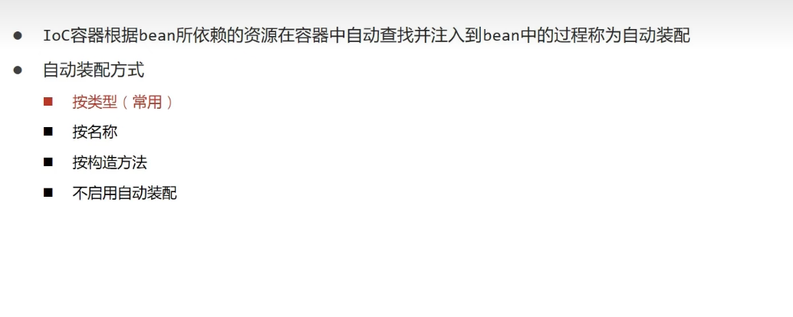

这条语句使用`name`属性进行了自动装配，有另外一种方法是按`type`，`type`属性要求注入的bean对象唯一，引用同一个类的多个bean对象不能按照`type`注入。按照名称匹配则没有这个问题，但是按名称耦合度过高，一般还是使用按类型。

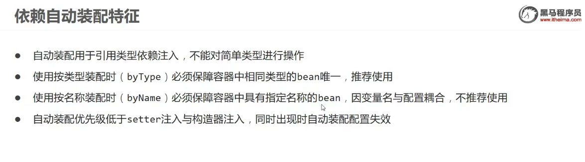

## 集合注入

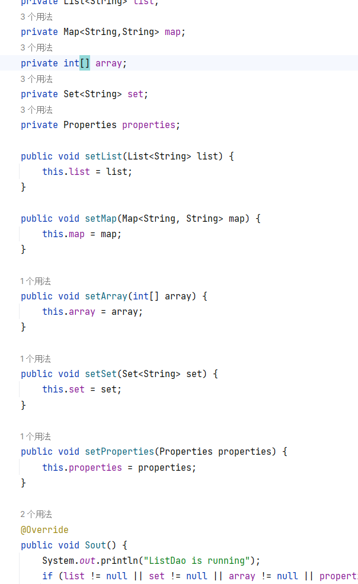

第一步提供set方法，定义变量。

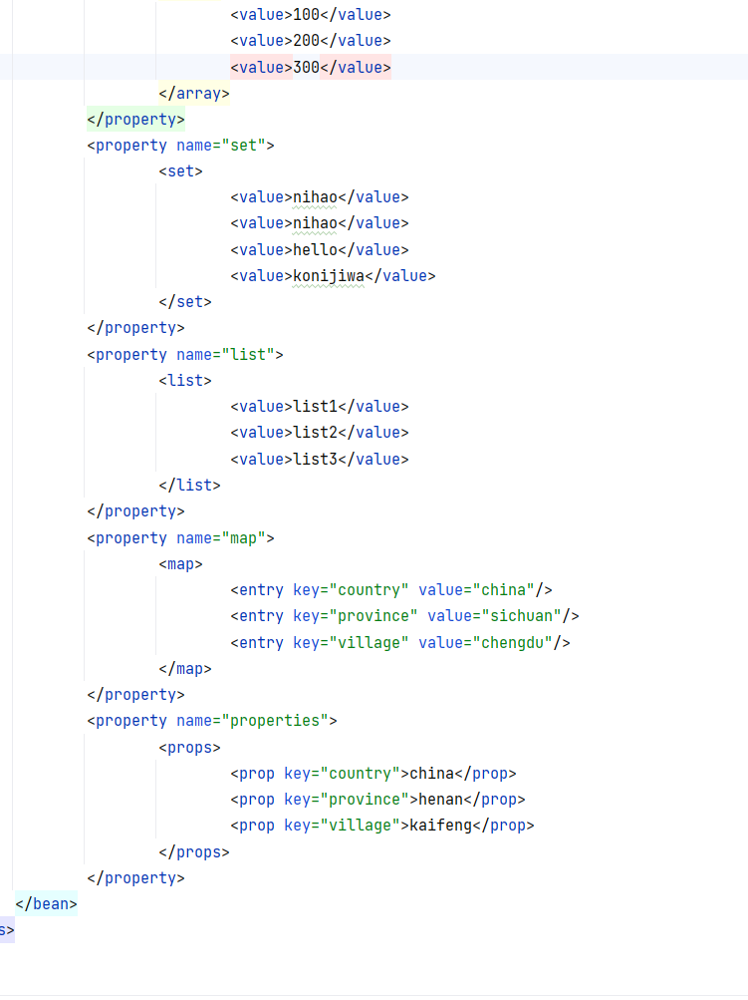

第二步，按照setter方法赋值。这里演示的是简单类型，也可以使用`< ...>`引用引用类型。

## 数据源对象管理

### 第三方资源配置管理示例

第一步，导入需要管理的对象。

第二步，查看对象是否提供构造方法或者setter方法，然后根据方法编写properties。

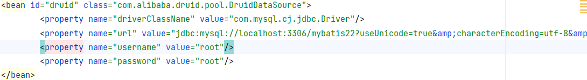

然后即可使用bean对象。

### 使用Spring加载properties文件

第一步，开启一个新的命名空间。

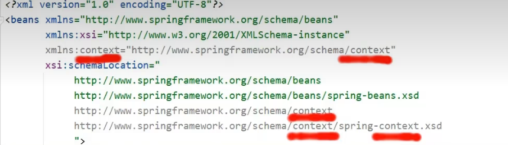

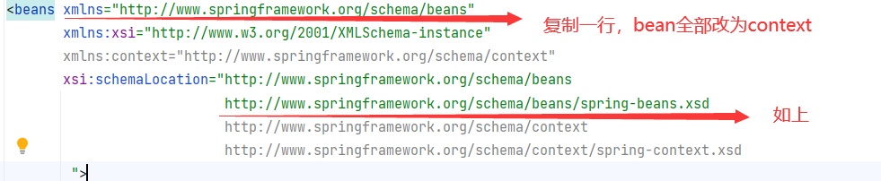

第二步，使用新的命名空间加载properties，在想要使用配置文件的地方使用属性名占位符。

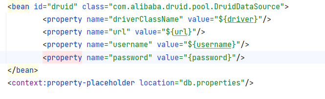

context中的这个属性可以控制是否加载系统变量。

加载多个properties有两种方法：
1. 使用通配符，如*.properties
2. 使用,号分割

最标准的写法是classpath:??.properties。

再加一个*表示不仅可以从当前工程文件读取，也可以从其它工程文件读取。写成`classpath*:db.properties`。

容器管理
   第一种，加载类路径下的配置文件
   第二种，加载绝对路劲的配置文件
   
   bean的加载也有两种额外的方式
   可以DAO dao = context.getbean(dao,DAO.class)
   也可DAO dao = context.getbean(DAO.class)
   第二种方法是按照类型查找，所以对应的bean对象只能有一个
   之前可以看到所有对象都是开始就初始化了，这是因为使用application加载bean对象所有bean对象都是积极加载的，再bean对象后添加lazy-init即可
   延迟加载
   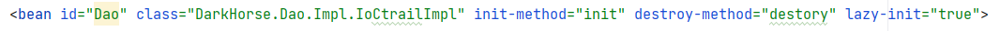
   

核心容器总结
   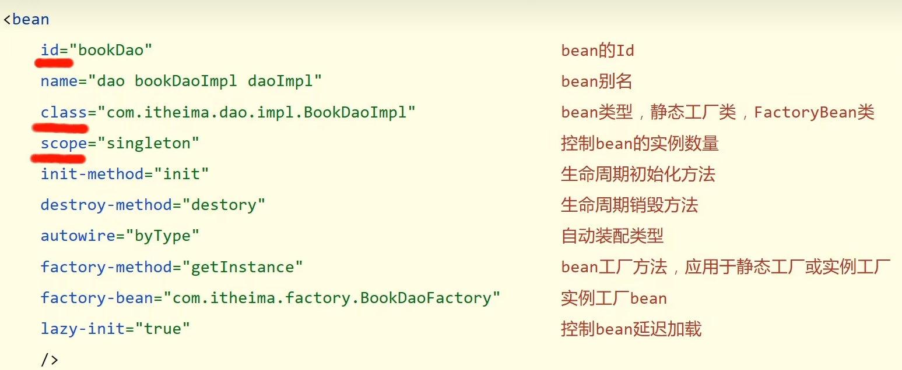
   bean的管理
   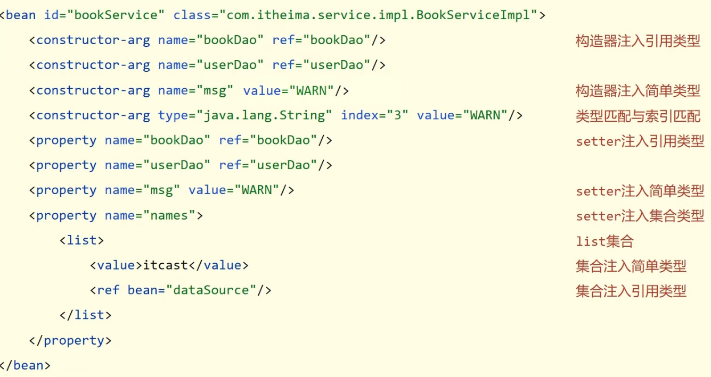
   注入
   
