Spring2.5注解的使用
    注册bean对象
        第一步开启包扫描
        
        第二步在想要注册的类中添加component注解，在注解方法中添加bean的注册名字
        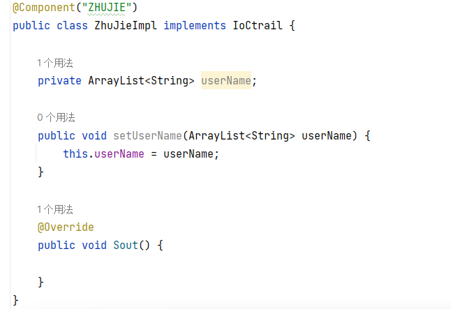
    
    在Spring中提供了三个下一层级的应用注解
    @Controller ： 用于表现层bean定义
    @Service ： 用于业务层的bean定义
    @Repository : 用于数据层的bean定义
    三个注解和@component功能一样

Spring3.0纯注解开发模式
    在使用注解开发之后，在xml中就不再配置bean对象了，不再配置bean对象了那xml中就只剩了一个包扫描，所以开始采用配置类的方法直接跳过xml
    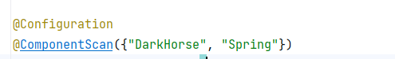
    创建配置类，注册配置类，然后开启包扫描，包扫描可以用数组传递多个值
    
    在app中以这种方式加载包扫描，这和传统的xml有所不同，其他的大体一致
    
    
配置类中的bean的管理
    
    注解控制是否单例，和xml配置大体一致
    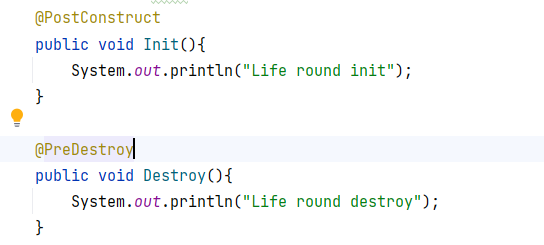
    用这两个语句控制bean对象的注册方法
    
    
依赖注入
    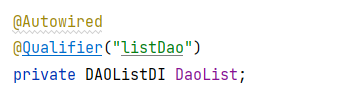
    使用Autowire自动注入，使用Qulify指定配置的bean对象，如果bean对象的类型不重复，那么可以省略Qulify
    也可使用alt insert使用spring的方法注入
    使用ctrl h查看类的上下继承关系
    bean对象依然需要无参构造方法
    
    简单属性注入直接使用value
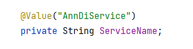

    加载properties文件
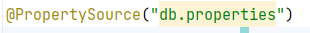
    在配置类中使用该方法
    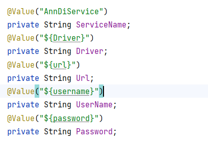
    值注入方式如下
    
生命周期
    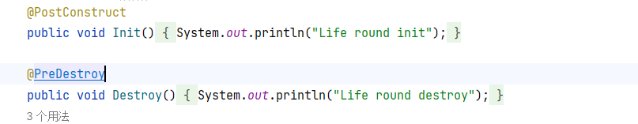
    用以上两个注解注册启动和销毁方法
    

管理第三方的bean
    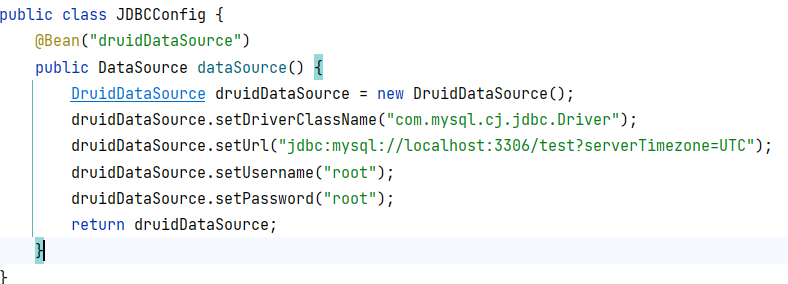
    第一步定义一个配置类，用一个方法创建对象，然后用@bean将方法的返回对象注册为bean对象
    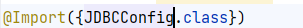
    然后再在spring配置类中使用import语句导入该类，使用集合传值
    
    对于外部对象的简单对象注入，直接使用value，而引用注入则在方法上添加目标对象
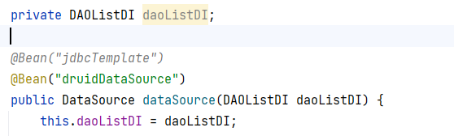

总结
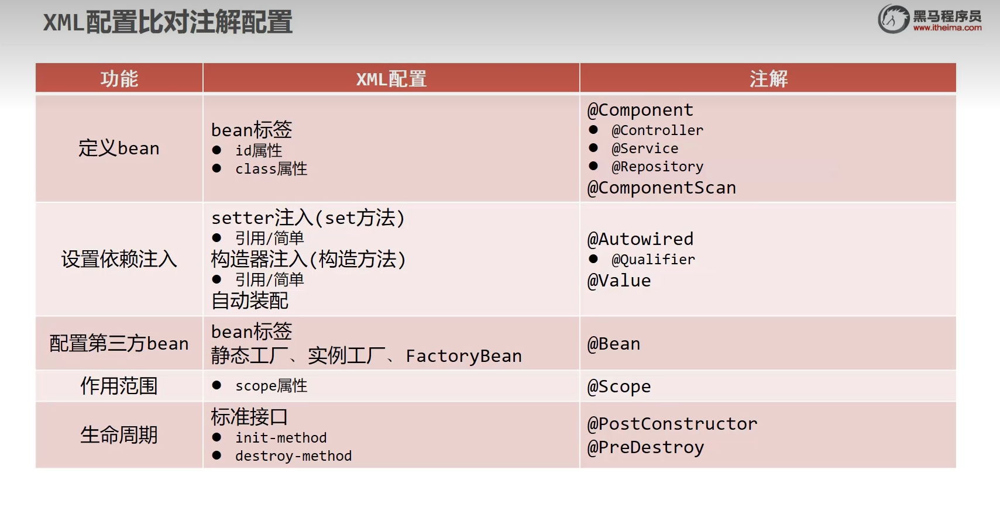