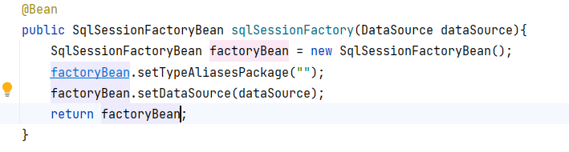
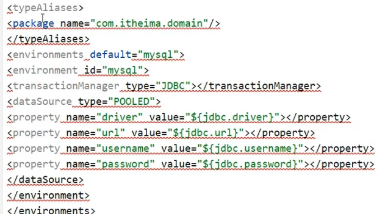
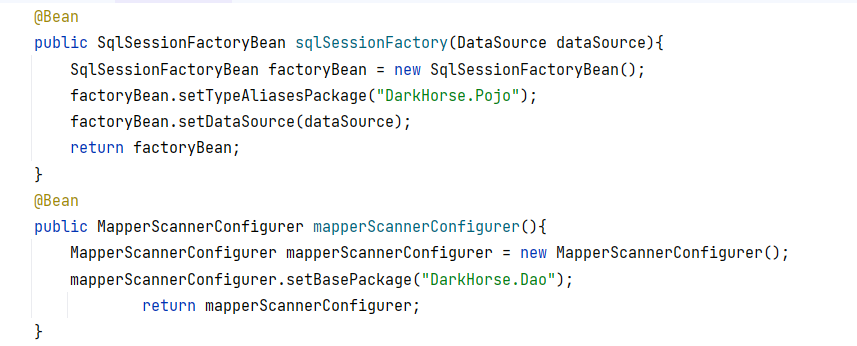
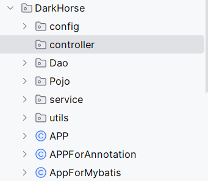

之前的javaweb中使用SQLSession来建立会话控制数据库，其中包含SQL sessionFactory和mapper业务，现在在spring框架中使用mybatis来管理，

需要以下几个坐标，
    第一个是spring-context
    第二个是mybatis
    第三个是mybatis-spring的整合包
    第四个是MySQL
    第五个是spring-jdbc

    spring和mybatis整合后，简化了以前建立session工厂的步骤，现在可以使用SqlSessionFactoryBean来建立session工厂，只做必要的工厂配置
    之前的SQL sessionFactory包含如下核心内容
    
    第一个定义实体类的包名
    第二个是DATA source
    

    SqlSessionFactory中配置的是和数据库对象映射的实体类对象，通过扫描代替原来的xml配置
    类似这种形式
<resultMap id="EmployeeResultMap" type="Employee">
<id property="id" column="id"/>
<result property="name" column="name"/>
<result property="age" column="age"/>
</resultMap>

    在MapperScannerConfiguration中配置的是原来的Mapper，用扫描配置类来代替原来的XML配置 

    现在在项目中的结构如下，从下到上依次为，实体类pojo,DAO数据层,Service业务层,controller表现层，和顶级APP
    外部并行一Config配置类，和bean工厂之类的工具类
    pojo对应数据库对象，DAO对应查询方法，Service使用DAO，controller使用Service

整个过程的运行逻辑是：
    第一步，创建SQL sessionFactory对象，然后通过代理的模式让工厂创建Session对象
    第二步，在之后使用mapper或DAO对象中用@Select或@update等注解创建的接口方法时就会被spring整合的mybaits代理执行
    第三步，在service中调用DAO数据层中的mapper接口实现的方法来进行数据操作
    
    另外比较关键的就是JDBC的配置
    
    这里的想法比较主观，目前为止还不是很清晰JDBC和mybatis的运行关系
    
    