Aop简介
    面向切片的编程，一种编程范式，指导开发者如何组织程序结构
    作用，在不惊动原始设计的情况下做增强
    无入侵，无切入编程

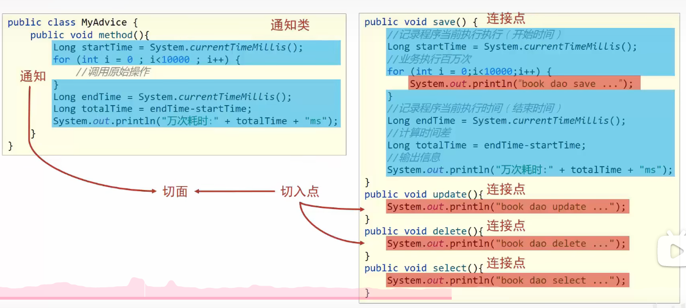
    核心思想是，将一个通用的方法抽出，抽出的方法叫做通知。装载这个通知的类叫做通知类
    而使用这个通知的方法叫做切点，
    切点和通知之间使用切面链接和绑定

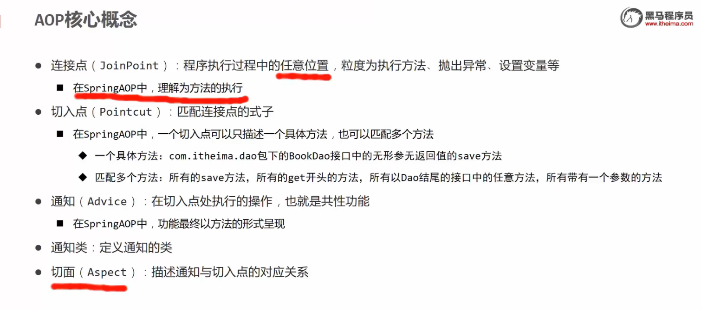

Aop入门案例
    在接口执行前输出当先系统时间
    导入坐标
    制作连接点方法
    制作共性功能
    定义切入点
    绑定切入点与通知的关系

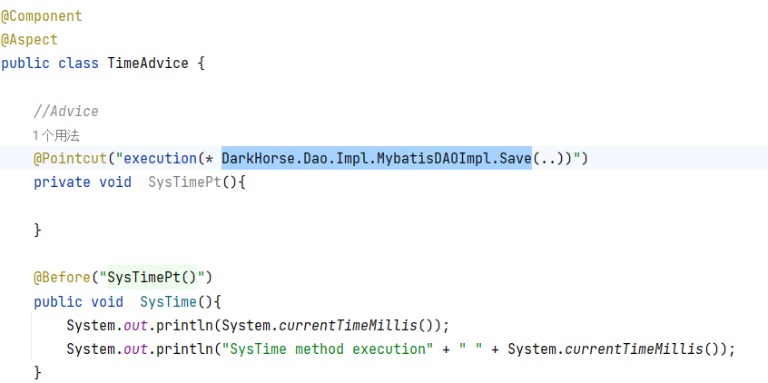

注册，切点，切面和通知
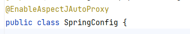
在config中开启切点扫描

大概的思路类似于钉钉子，然后在钉子上挂东西

这里遇到了一个问题，开启AOP后，被切入的类如果有接口的继承关系就会导致bean对象无法成功是别的错误，如下
Exception in thread "main" org.springframework.beans.factory.NoSuchBeanDefinitionException: No qualifying bean of type 'DarkHorse.Dao.Impl.MybatisDAOImpl' available
at org.springframework.beans.factory.support.DefaultListableBeanFactory.getBean(DefaultListableBeanFactory.java:352)
at org.springframework.beans.factory.support.DefaultListableBeanFactory.getBean(DefaultListableBeanFactory.java:343)
at org.springframework.context.support.AbstractApplicationContext.getBean(AbstractApplicationContext.java:1127)
at DarkHorse.AppForAOp.main(AppForAOp.java:12)

在删除继承关系后，程序成功运行

Life round init
ZhuJieDAO is Init
1716688910311
SysTime method execution 1716688910311
User Saved

在bean对象中，强制使用cglib代理也可以成功
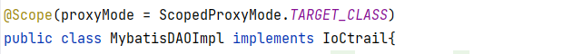

降低版本似乎也可以实现，待查证

描述：
　　现象一 ：A 为 接口，AImpl 为 A 的实现类，且 AImpl 受 aop 扫描，且 aop 无特殊配置

此时若：Spring 中 注入 AImpl 类型的bean，获取一样     报错

Spring 中 注入 A 类型的bean ，获取一样          成功

现象二 ：B 没有实现接口，B受 aop 扫描，且 aop无特殊配置

此时若：Spring 中 注入 B 类型的bean，获取一样           成功

分析：
　　1、如果目标对象实现了接口，默认情况下会采用JDK的动态代理实现AOP 
　　2、如果目标对象实现了接口，可以强制使用CGLIB实现AOP 
　　3、如果目标对象没有实现了接口，必须采用CGLIB库，spring会自动在JDK动态代理和CGLIB之间转换

现象一 ：因为 AImpl 实现了 A 接口，所有自动使用了JDK proxy ，而JDK proxy 实现原理基于接口生成代理对象（详见下边链接）

代理对象 类型不同于 AImpl ，所以报错

JDK proxy 生成的代理对象也实现了A 接口，so  接口类型可以。

现象二 ：B 没有实现接口，故spring 采用 cglib 实现动态代理，其原理是生成子类（详见下边链接）

so , 成功注入与获取。

解决：
　　 Spring 中添加配置  <aop:aspectj-autoproxy proxy-target-class="true"/>

AOP工作流程
    Spring容启动
    读取所有切面配置的切入点
    初始化类，判断类中的方法是否匹配上一个切入点，如果类中的切入点和一个切入点匹配，则将这个切入点与通知绑定
    如果匹配失败则创建对象，
    匹配成功则会创建原始（目标对象）的代理对象（代理执行增强操作）
    获取bean时获取的是bean的代理对象，根据代理模式进行增强
    
    

AOP切入点表达式
    描述一，按接口中的无参方法实现
    描述二，按照实现类方法实现
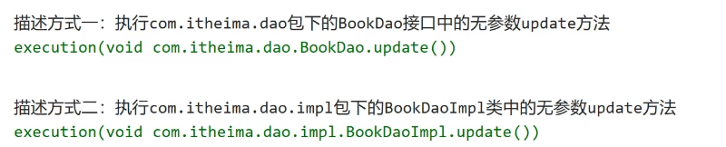
    切入点表达式的标准格式
    execution (pubulic（一般不写） user（返回值） UserDaoImpl.save(int)（描述方法）)
    

    切入点通配符
    *代表任意
    ..代表任意个参数
    +代表必须有参数
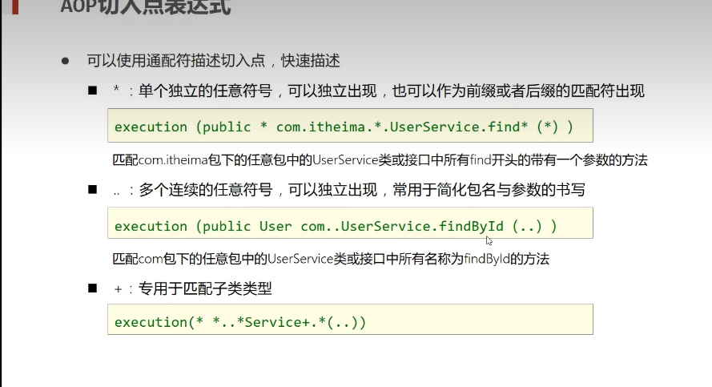    

、   
    描述一般描述到接口，描述到实现类就紧耦合了
    详细规则如下
    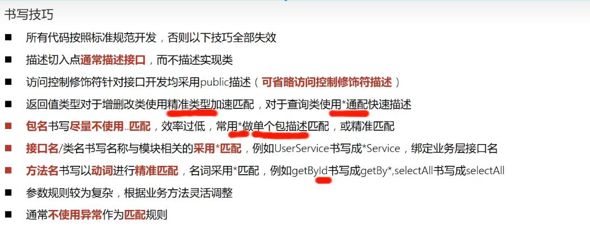

AOP的通知类型
    前置通知
    后置通知
    环绕通知(重点)
    返回后通知（了解）
    抛出异常后通知（了解）

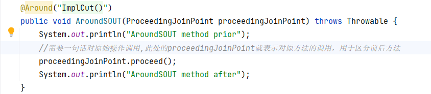
    使用环绕通知需要注意，如果被环绕的放法有返回值则需要在通知里添加返回值，否则会报错
    Exception in thread "main" org.springframework.aop.AopInvocationException: Null return value from advice does not match primitive return type for: public int DarkHorse.Dao.Impl.MybatisDAOImpl.Save()
    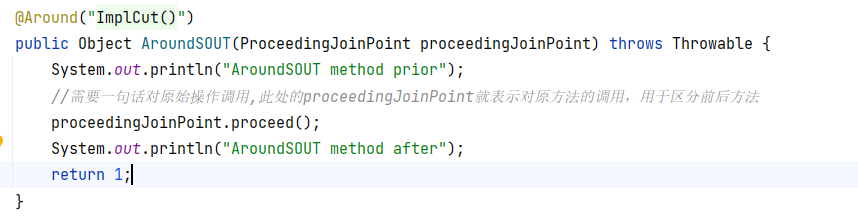
    将返回值改为Object并赋返回值即可消除报错
    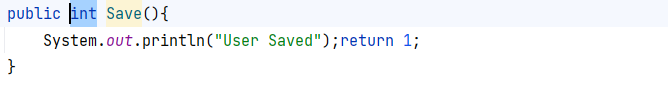
    此处将save方法的返回值改为Int
    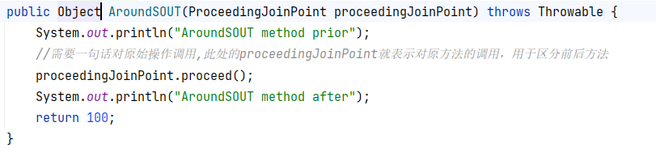
    将函数返回值也改为INT
    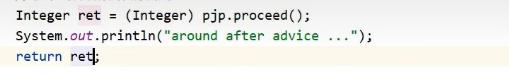
    表示AOP的增强方法中的被增强方法的返回值可以接出也可以返回
    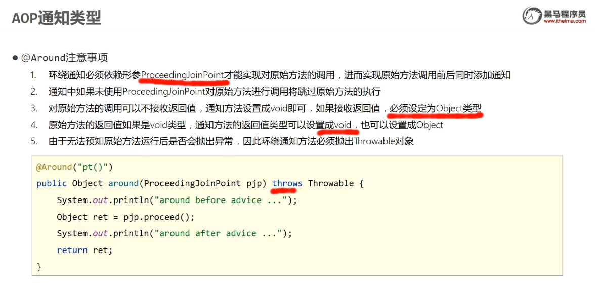

AOP万次执行效率
    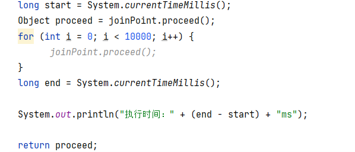
    做好基础配置后，代码很简单，但是这种方式不能识别代码的身份信息。
    Spring提供了一个解决方案，即签名方法
    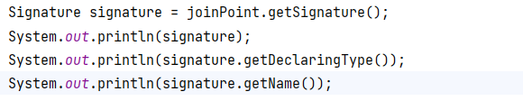
    这个方法效果如下
    
    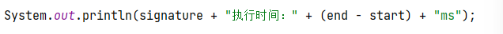

AOP通知获取数据
    获取参数，返回值和异常
    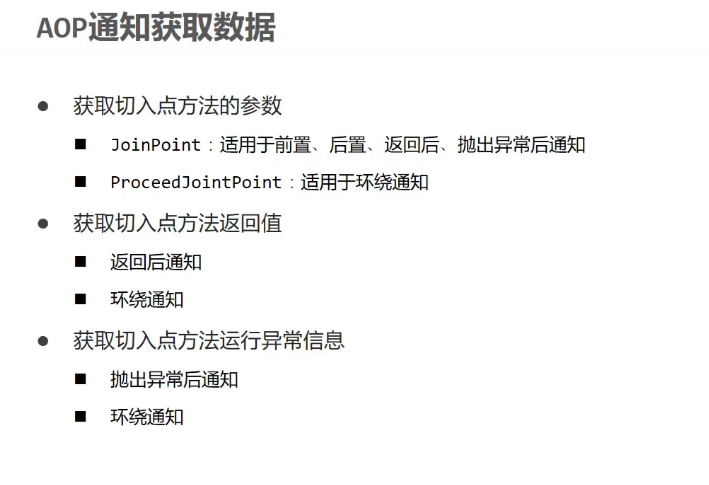
    通过实现ProcessJoinPoint的父节点JoinPoint的方法可以达到获得返回值的效果
    同时也可以通过修改这个数组的方式修改得到的返回值然后进行处理
    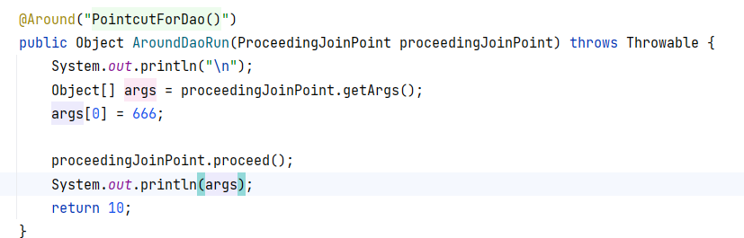
    后面还有两种获取返回值的方法，After和Afterthrowing
    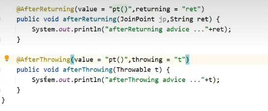
    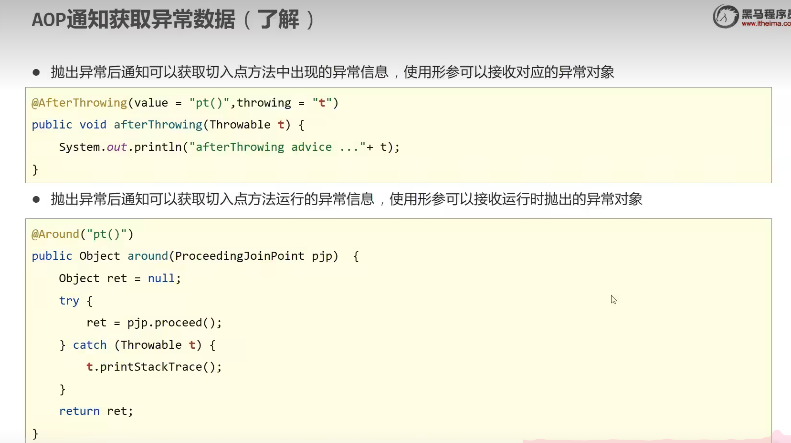
    

AOP案例，百度网盘数据兼容
    处理密码输入的空格
    在业务方法之前对所有输入的参数进行格式处理
    使用处理后的参数调用原始方法--环绕通知中存在对原始方法的调用
    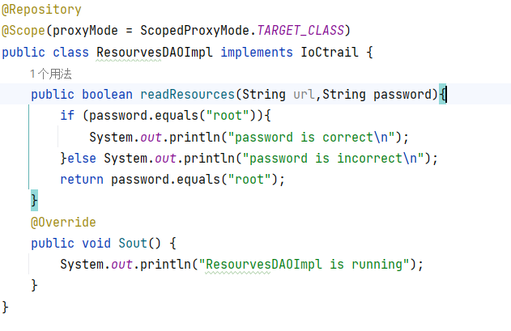
    编写了一个DAO对业务进行模拟，在代码中还编写了一个Service这里不做展示
    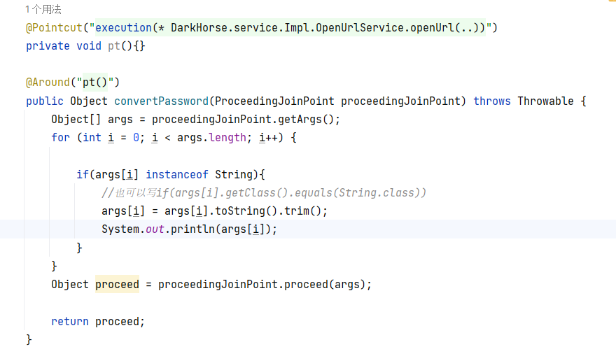
    AOP中主要是这几个步骤
    第一步，通过proceedingPointCut获得原始方法，通过getArgs获得方法参数
    第二步，对参数进行处理，这里对参数进行了格式化处理
    第三步，在Arround方法中调用原始方法，并将修改后的参数返回给原始方法
    
AOP总结
    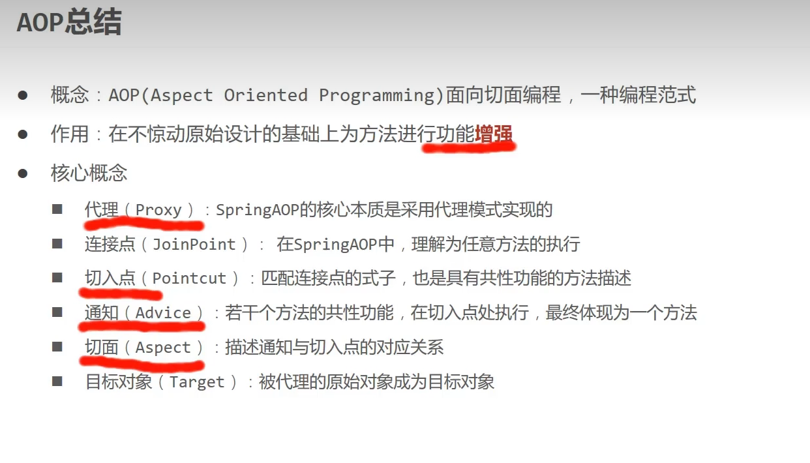
    在环绕通知中使用ProceedingPointCut来获取原始方法，在其他通知中直接使用join point即可
    