当然，我可以帮助你将这份MD笔记的格式规范化。以下是规范化后的内容：

---

# Spring 事务简介

在 Spring 中，事务用来保障事件的一致性，作用于事物层和业务层。Spring 在业务层提供了一个接口 `PlatformTransactionManager`，其中包括提交和回滚操作。

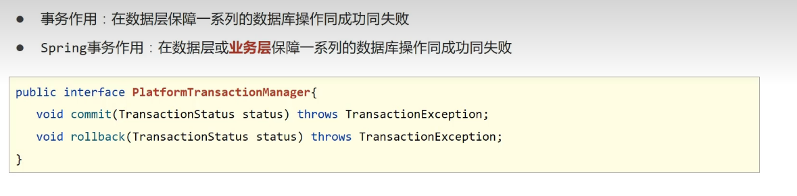

其中一个实现类是 `DataSourceTransactionManager`，它也包括提交和回滚操作。

## 案例：银行账户转账

### 需求

- 用户A加钱，用户B减钱。

### 数据层

- 指定用户减钱
- 指定用户加钱

### 业务层调用操作

- 提供两个账号和操作金额执行转账操作
- 基于 Spring 整合 MyBatis 进行操作

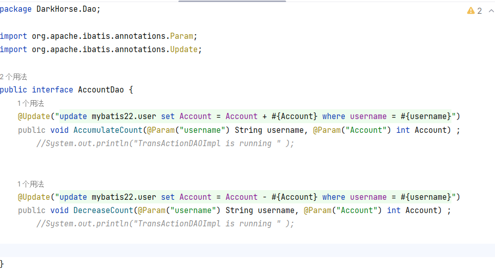

#### 第一步：数据层的 Mapper 接口

Spring 会根据 `Springconfiguration` 自动生成一个实现类，并自动注入到 Spring 容器中。

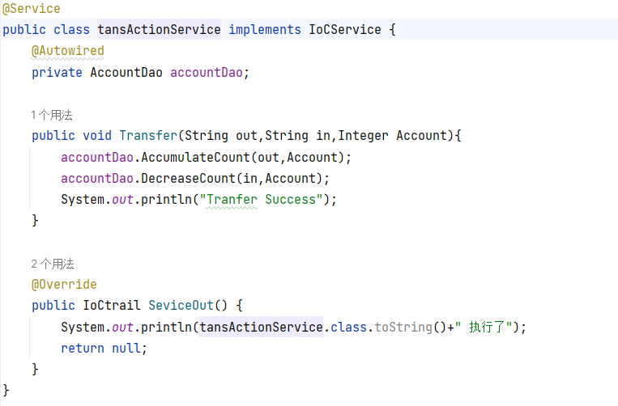

#### 第二步：编写调用方法的业务层代码

#### 第三步：在 APP 中测试

现在发现，如果在程序运行中出现异常，业务后面的代码则无法实现。

### 使用 @Transactional 注解开启事务

这个注解一般写在接口上。

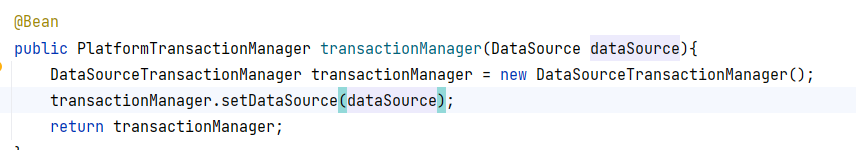

在 `JDBCConfig` 中配置事务管理。现在，如果原来的方法再出现事务失败就会发生回滚，成功或失败保持一致。

## 事务的角色

- 事务管理员
- 事务协调员

在之前的两个案例中其实是两个独立的事务，所以报异常时谁都不会回滚。

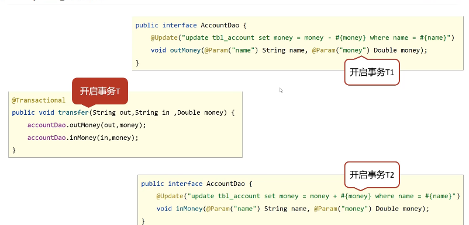

现在将事务1和事务2都加入事务T，就只有一个事务了。Spring 开启的事务叫做事务管理员，加入事务的叫事务协调员。

## 事务相关配置

- 事务配置
- 案例：转账业务追加日志
- 事务传播行为

对 Spring 中的事务进行精细化管理需要一些相关的配置。

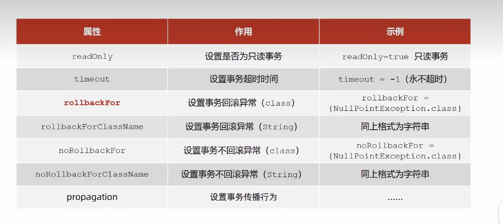

`RollbackFor` 为重点，设置事务的回滚异常，指定遇到某个异常回滚事务。默认情况下，事务遇到 `Error` 错误或者 `RuntimeException`（运行时异常）错误都会回滚事务，其它情况不会回滚。

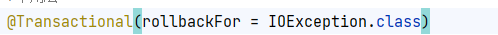

现在遇到异常也会回滚事务。

### 基于转账操作添加日志模块

无论操作是否成功，均进行转账操作的日志留痕。

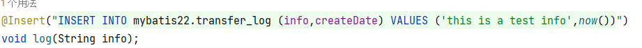

由于 Mapper 方法无法匹配类型，可能是因为 `money` 属性为 int 值没有处理，这里直接改写为测试。

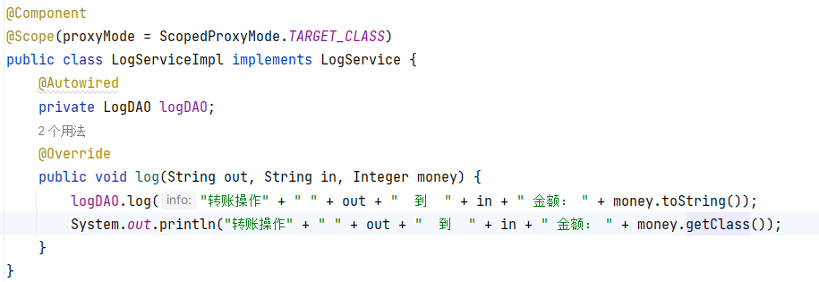

### Service 方法

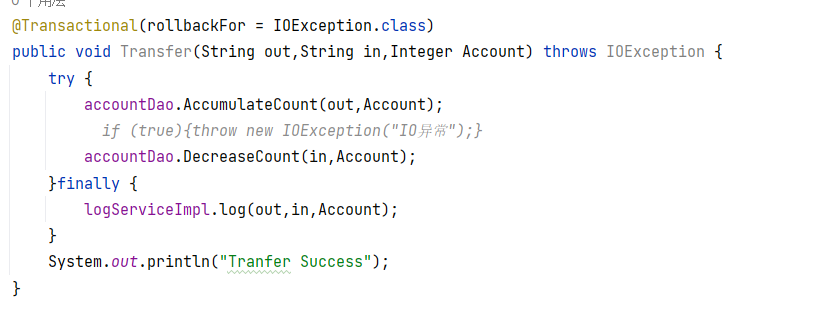

事务方法调用，使用 `try-finally` 格式让日志语句始终执行。现在的代码还有一个问题，日志和数据库操作属于同一个事务，成功或失败都是一起的。

### 事务的传播行为

事务协调员对事务管理员所携带的事务的处理态度（加入、不加入、新事务）。

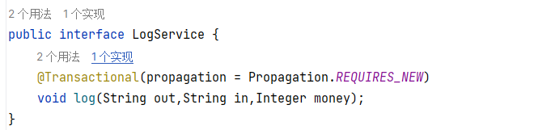

在协调员中新开一个事务，这个事务对于管理员的态度是新开一个事务。

# Spring MVC 简介

Spring MVC 和之前学习的 Servlet 一样，是用来进行表现层开发的 Web 技术。MVC 比 Servlet 更为简便。

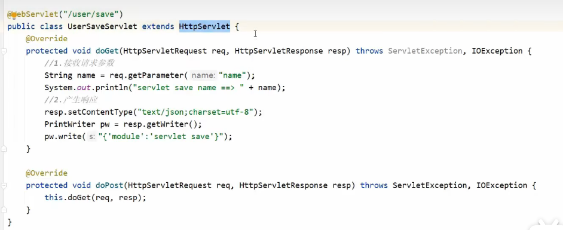

上图是原始的 Servlet 格式，用于处理 `doGet` 和 `doPost` 等网络请求，渲染在 JSP 页面上。

在 MVC 中要学习以下内容：

- 请求与响应
- REST 风格
- SSM 整合
- 拦截器

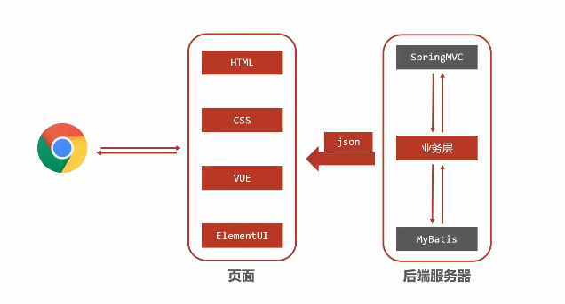

## Spring MVC 入门案例

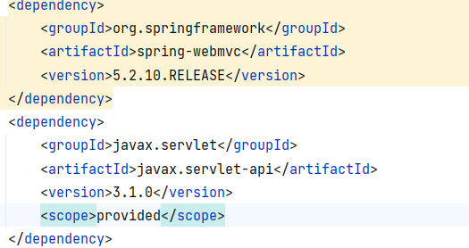

### 第一步：导入 Spring MVC 的依赖，并添加 MVC 的配置类

Spring MVC 中提供了一个专用的用于开发 Web 容器（Servlet）的配置类。

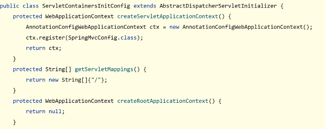

### 第二步：创建 MVC 的 Bean 对象，使用 @Controller

### 第三步：定义一个方法作为返回体，并添加访问路由

初始化 Servlet 容器，加载 Spring MVC 环境，并设置 Spring MVC 处理的请求。

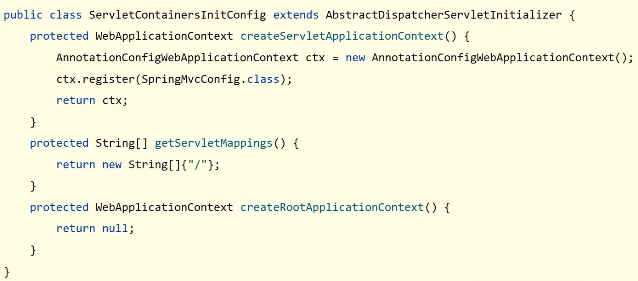

第一个用于加载 Spring 环境，第二个用于确定哪些请求交给 Spring MVC 处理，这里配置为拦截所有请求。

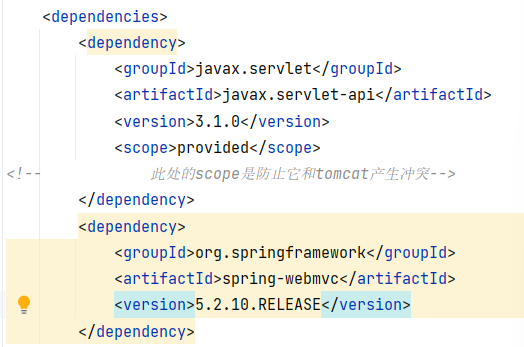

创建一个mvn项目，选择Web骨架，
导包，编写Spring配置类，MVC配置类，controller方法
添加tomcat插件
编辑运行配置，

SpringMVC入门案例工作流程分析
    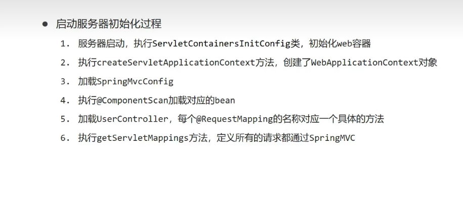

将SpringMVC和Spring的bean对象分开管理
    spring加载时排除SpringMVC的bean
    方法一时指定扫描的对象
    方法二使用exclude排除一些对象
    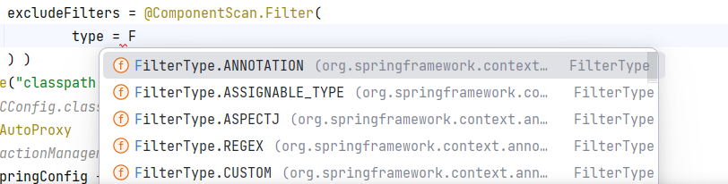
    设置排除的类型
    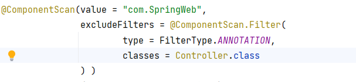
    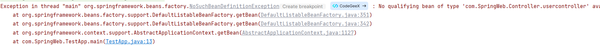
    成功报错bean对象未定义
    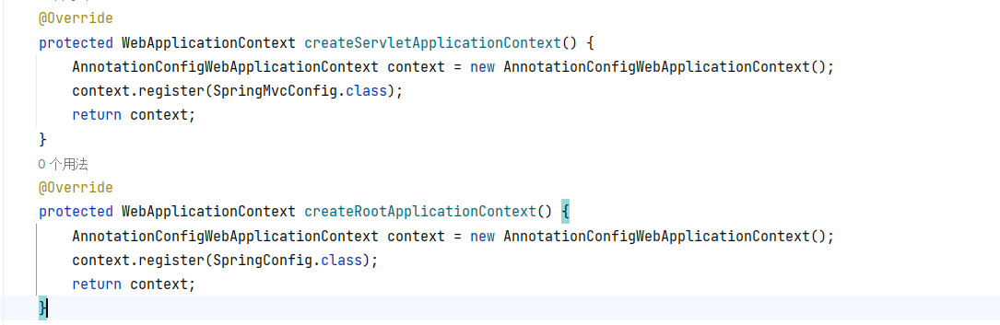
    在tomcat的启动类中,第一个用于配置SPringMVC的配置类,第二个用于配置Spring的配置类
    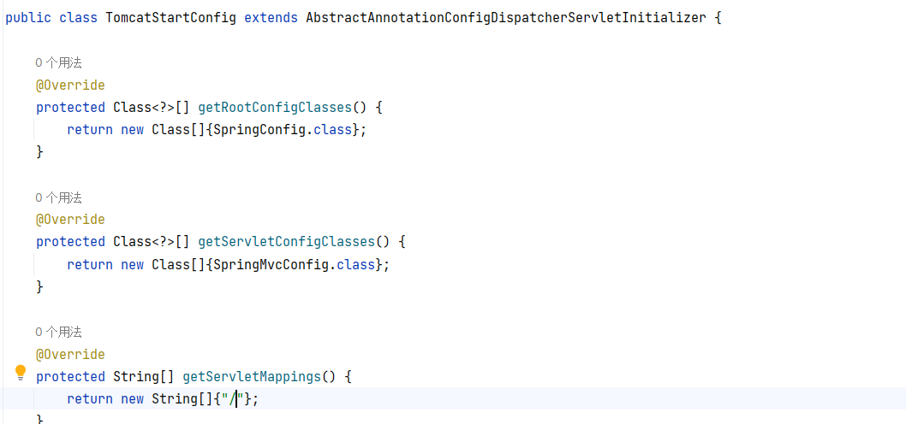
    使用新的注解简化Tomcat启动类的开发
    